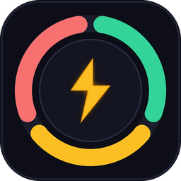
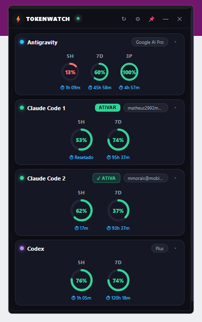
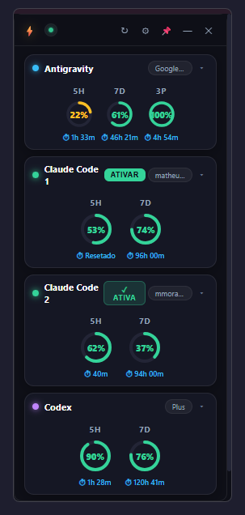
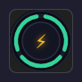

<p align="center">
  
</p>

<h1 align="center">TokenWatch</h1>

<p align="center">
  <strong>The real-time quota, rate-limit & token HUD for AI coding assistants.</strong><br>
  <em>Built for Google Antigravity, Anthropic Claude Code & OpenAI Codex.</em>
</p>

<p align="center">
  <a href="https://github.com/Matheus-Morais/monitor-cotas/blob/master/LICENSE"></a>
  
  
  
  <a href="https://github.com/Matheus-Morais/monitor-cotas/pulls"></a>
</p>

---

## 🌟 Overview

**TokenWatch** is a sleek, hardware-accelerated desktop HUD and floating widget designed for developers who heavily rely on modern AI coding assistants. It keeps live track of your 5-hour rate limits, weekly quotas, and reset countdowns without interrupting your workflow.

With a single hotkey (**`Ctrl + Shift + C`**) or mouse click, switch between the **full HUD panel** and a minimal **floating circular Avatar (⚡)** that sits unobtrusively on top of your editor.

<p align="center">
  
  &nbsp;&nbsp;&nbsp;&nbsp;
  
  &nbsp;&nbsp;&nbsp;&nbsp;
  
</p>

---

## ✨ Features

- ⚡ **Floating Lightning Avatar (72 × 72 px):** A tiny circular widget clipped natively via Win32 elliptical regions. Displays real-time tri-color health arcs and seamlessly transitions into a **live critical percentage badge with breathing pulse glow** when any quota drops below your threshold, complete with hover tooltips.
- 📊 **Modern GPU-Accelerated HUD:** Built with Microsoft Edge Chromium (WebView2) + SVG circular wheels, delivering smooth animations and dark glassmorphic styling at 60+ FPS.
- 🔄 **Instant Claude Code Account Switcher:** Toggle between multiple Claude profiles (`.claude-1.json`, `.claude-2.json`) with a single click—no manual `claude logout` or browser authentication hoops required.
- 📐 **Responsive & Fully Resizable:** Drag any of the 8 borders or the diagonal grip in the footer. Fluidly scales from wide dashboards down to an ultra-compact **240px** layout.
- ⌨️ **Global Hotkey:** Press `Ctrl + Shift + C` anywhere in Windows to toggle between the Avatar and the Full Panel instantly.
- 🛡️ **Zero-Freeze Decoupled Architecture:** Telemetry collection and UI rendering run on completely separate threads. Telemetry updates never block the GUI thread.
- 🪟 **Smart Screen Clamping:** Automatically respects the monitor's usable work area (`SPI_GETWORKAREA`) so the window never spawns behind the taskbar or off-screen.
- 📌 **Always on Top & System Tray:** Pin the HUD above all windows or minimize to the Windows System Tray with a right-click context menu.

---

## 🤖 Supported Providers

| Provider | Tracked Limits | Countdown & Health | Multi-Account Support |
| :--- | :--- | :--- | :--- |
| **Google Antigravity** | 5h Gemini Quota, Weekly Limit, 3P 5h Quota | Exact countdown to reset, percentage wheel | Monitored via local CLI status |
| **Anthropic Claude Code** | 5-Hour Rolling Limit, 7-Day Weekly Limit | Real-time countdowns (`Resets in Xh Ym`) | **Yes** — 1-click active account switching |
| **OpenAI Codex CLI** | 5h Session Limit, 7-Day Window | Parsed from local session SQLite & rollouts | Account status badge & token usage |

---

## 🚀 Getting Started

### Option 1: Pre-built Executable (Recommended)
1. Download the latest `TokenWatch.exe` from the [Releases](https://github.com/Matheus-Morais/monitor-cotas/releases) page.
2. Run `TokenWatch.exe`.
3. Press `Ctrl + Shift + C` or click the circular lightning bolt (`⚡`) to expand the HUD.

### Option 2: Run from Source

#### Prerequisites
- Windows 10 or 11
- Python 3.10+
- Microsoft Edge WebView2 Runtime (pre-installed on modern Windows)

```powershell
# 1. Clone the repository
git clone https://github.com/Matheus-Morais/monitor-cotas.git tokenwatch
cd tokenwatch

# 2. (Optional) Create a virtual environment
python -m venv .venv
.\.venv\Scripts\Activate.ps1

# 3. Install dependencies
pip install -r requirements.txt

# 4. Launch TokenWatch
python quota_webview_app.py
```

---

## ⌨️ Controls & Shortcuts

| Action | Control | Description |
| :--- | :--- | :--- |
| **Toggle Mode** | `Ctrl + Shift + C` | Alternate between the Full HUD and Floating Avatar |
| **Expand Avatar** | `Click on ⚡ Avatar` | Expands the 72x72 disc into the full panel HUD |
| **Minimize to Avatar** | `—` (Header Button) | Shrinks the panel into the circular Avatar |
| **Resize Panel** | `Drag Borders / ◿ Grip` | Pull any of the 8 edges or footer grip to resize |
| **Pin / Unpin** | `📌` (Header Button) | Toggle Keep-on-Top mode |
| **Refresh Quotas** | `↻` (Header Button) | Force telemetry refresh and poll CLI usage |
| **Customize Wheels** | `⚙` (Header Button) | Choose which quota rings to display per provider |
| **Switch Claude Account** | `ATIVAR` Button | Instantly activates Account 1 or Account 2 |
| **System Tray** | `Right-click Tray Icon` | Access modes, restore, and exit |

---

## ⚙️ Configuration

TokenWatch stores your window dimensions, positions, and active wheel selections in `config.json` (auto-created next to the executable or script):

```json
{
  "ui_mode": "panel",
  "avatar_size": 72,
  "panel_geometry": {
    "width": 384,
    "height": 580
  },
  "visible_metrics": {
    "agy": ["gemini_5h", "gemini_weekly", "3p_5h"],
    "claude1": ["five_hour", "seven_day"],
    "claude2": ["five_hour", "seven_day"],
    "codex": ["five_hour", "seven_day"]
  }
}
```

You can customize which wheels are shown directly from the in-app `⚙` settings modal.

---

## 🔨 Building from Source

To package TokenWatch into a standalone single-file `.exe`:

```powershell
.\build.ps1
```

The compiled binary will be placed in `dist/TokenWatch.exe`.

---

## 🧪 Testing

TokenWatch comes with an automated unit test suite verifying telemetry collection, normalization, account switching, and state transitions:

```powershell
python -m unittest discover -v
```

---

## 🤝 Contributing

Contributions are warmly welcome! Whether reporting a bug, proposing a provider integration, or improving the UI:

1. Check existing issues or open a new one.
2. Fork the repo and create your feature branch (`git checkout -b feat/my-feature`).
3. Commit your changes (`git commit -m 'feat: add support for NewProvider'`).
4. Read [`CONTRIBUTING.md`](CONTRIBUTING.md) for testing guidelines.
5. Open a Pull Request!

---

## 📄 License

This project is open source and available under the [MIT License](LICENSE).
Created with care by [Matheus Morais](https://github.com/Matheus-Morais).
